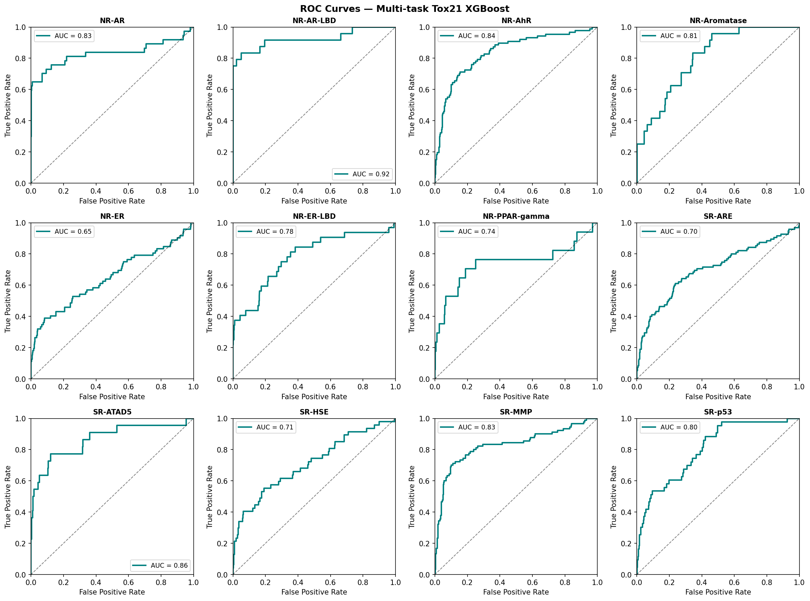
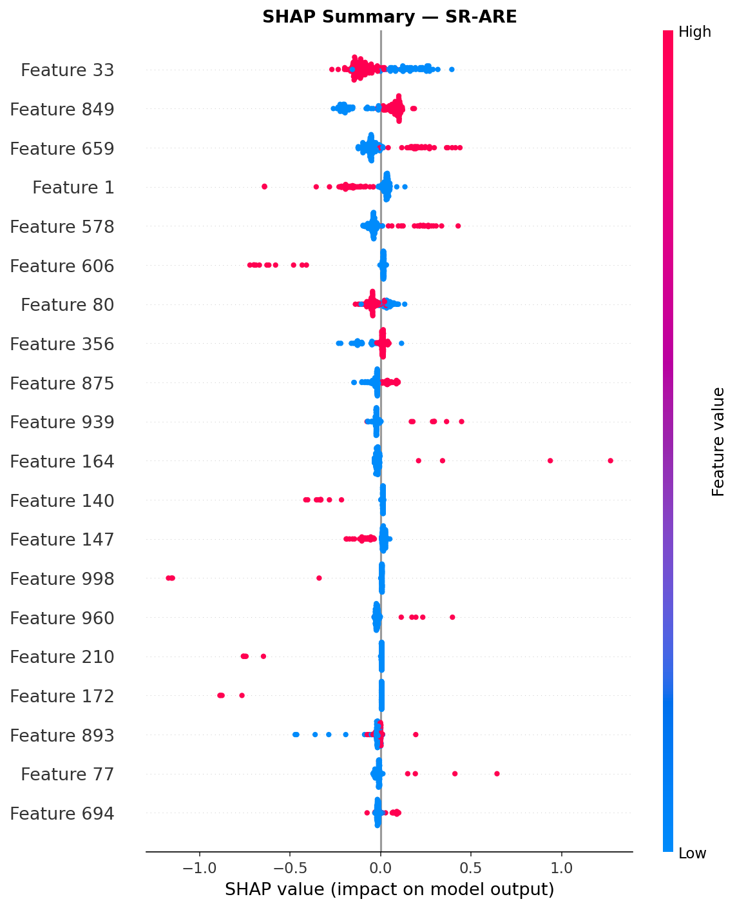
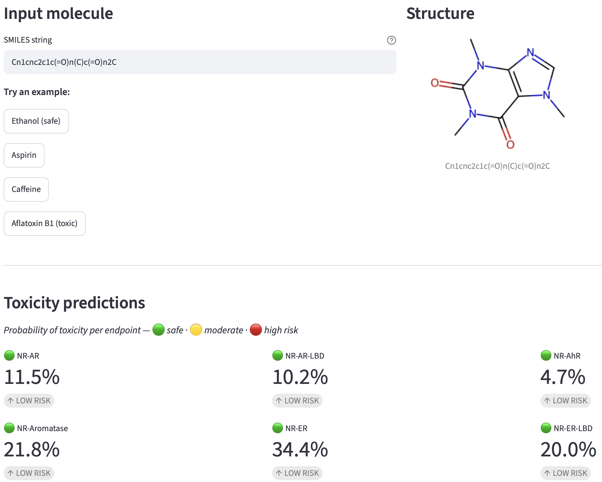

# ADMET Toxicity Predictor — Tox21

A ML project to predict molecular toxicity across **12 Tox21 endpoints** from molecular structure alone, using XGBoost + Morgan fingerprints.

---

## What's the problem?

One of the biggest bottlenecks in drug discovery is that a molecule can work perfectly against its target and still fail in clinical trials because it's toxic. Drug-induced liver injury (DILI) accounts for ~1 in 4.5 clinical trial failures and 1 in 3 market withdrawals due to adverse drug reactions (Dirven et al., 2021), making hepatotoxicity the leading organ-specific cause of drug attrition.

The goal here was to see how well we can predict toxicity risk from molecular structure alone with no wet lab experiments, just a SMILES string.

---

## Dataset

**Tox21** a benchmark from Wu et al. (*MoleculeNet, Chemical Science, 2018*) with ~8,000 molecules tested across 12 toxicity assays covering nuclear receptor and stress response pathways.

- **6,258** training molecules · **783** test molecules
- **12 endpoints**: NR-AR, NR-AR-LBD, NR-AhR, NR-Aromatase, NR-ER, NR-ER-LBD, NR-PPAR-gamma, SR-ARE, SR-ATAD5, SR-HSE, SR-MMP, SR-p53
- Heavily imbalanced: toxic class ranges from **2.4% to 12.1%** depending on the endpoint

---

## Approach

```
SMILES string → Morgan fingerprints (ECFP4, 1024 bits) → XGBoost → toxicity probability
```

1. Load data via **DeepChem** (`load_tox21` with ECFP featurizer)
2. Train one **XGBoost** classifier per endpoint, with `scale_pos_weight` tuned per task to handle class imbalance
3. Evaluate with AUC-ROC on held-out test set
4. Explain predictions with **SHAP** (SR-ARE focus)
5. Validate on known hepatotoxic compounds

---

## Results

| Endpoint | Test AUC |
|----------|----------|
| NR-AR | 0.807 |
| NR-AR-LBD | 0.831 |
| NR-AhR | 0.826 |
| NR-Aromatase | 0.844 |
| NR-ER | 0.766 |
| NR-ER-LBD | 0.793 |
| NR-PPAR-gamma | 0.807 |
| SR-ARE | 0.790 |
| SR-ATAD5 | 0.754 |
| SR-HSE | 0.705 |
| SR-MMP | 0.853 |
| SR-p53 | 0.773 |
| **Mean** | **0.796** |

AUC ~0.80 is consistent with what tree-based models achieve on Tox21. Getting above ~0.85 systematically would require graph neural networks or 3D structural features.

### ROC Curves (all 12 endpoints)



### SHAP Feature Importance — SR-ARE

Each point is a molecule. Red = fingerprint bit present, blue = absent. Points to the right push the prediction toward *toxic*.



---

## Validation on known molecules

| Molecule | Risk score (SR-ARE) | Prediction | Reality |
|----------|---------------------|------------|---------|
| Paracetamol | 0.563 | HIGH | Hepatotoxic at high doses ✓ |
| Aspirin | 0.452 | LOW | Generally safe ✓ |
| Troglitazone | 0.541 | HIGH | Withdrawn in 2000 for fatal hepatotoxicity ✓ |
| Caffeine | 0.468 | LOW | Generally safe ✓ |

---

## Streamlit app

A live prediction interface: paste any SMILES string and get toxicity probabilities across all 12 endpoints.



### Run locally

```bash
# 1. Clone and install
git clone https://github.com/cecilesde/admet-toxicity-predictor
cd admet-toxicity-predictor
pip install -r requirements.txt

# 2. Train the model (first time only)
cd notebooks
jupyter notebook 02_multitask_model.ipynb

# 3. Launch the app
streamlit run app.py
```

---

## Project structure

```
admet-toxicity-predictor/
├── notebooks/
│   ├── 01_srare_xgboost.ipynb     # SR-ARE focused exploration + SHAP
│   └── 02_multitask_model.ipynb   # All 12 endpoints + ROC + SHAP + save model
├── model/
│   └── multitask_xgb.pkl          # Trained models dict {task: XGBClassifier}
├── figures/                        # ROC curves, SHAP plots
├── data/                           # Tox21 raw data (auto-downloaded via DeepChem)
├── app.py                          # Streamlit prediction interface
└── src/                            # Helper utilities
```

---

## Stack

- `deepchem` dataset loading + featurization
- `rdkit` molecular fingerprints (Morgan/ECFP4)
- `xgboost` gradient boosting classifier
- `shap` model explainability
- `scikit-learn` cross-validation, metrics
- `streamlit` interactive prediction UI

---

## Limitations

- Morgan fingerprints lose all 3D structural information
- SR-ARE is a proxy for oxidative stress-induced hepatotoxicity, not a direct measurement
- The model doesn't account for dose (any molecule is toxic at high enough concentration)
- ~6k training molecules: small dataset for this kind of problem
- `MultiOutputClassifier` trains independent models: no cross-endpoint information sharing

## What I'd do next

- Try graph neural networks (GNNs, e.g. AttentiveFP) on the same task for comparison
- Look into 3D-aware molecular representations (e.g. SchNet, DimeNet)
- Add ADMET properties beyond toxicity: solubility, permeability, metabolic stability

---

*Dataset:* Wu Z, Ramsundar B, Feinberg EN, et al. MoleculeNet: a benchmark for molecular machine learning. *Chemical Science*. 2018;9(2):513–30.

*Sources:*
- Dirven H, Vist GE, Bandhakavi S, et al. Performance of preclinical models in predicting drug-induced liver injury in humans: a systematic review. *Sci Rep* 11, 6403 (2021). https://doi.org/10.1038/s41598-021-85708-2
- Kim MT, Huang R, Sedykh A, et al. Mechanism Profiling of Hepatotoxicity Caused by Oxidative Stress Using Antioxidant Response Element Reporter Gene Assay Models and Big Data. *Environ Health Perspect*. 2016;124(5):634–41.
