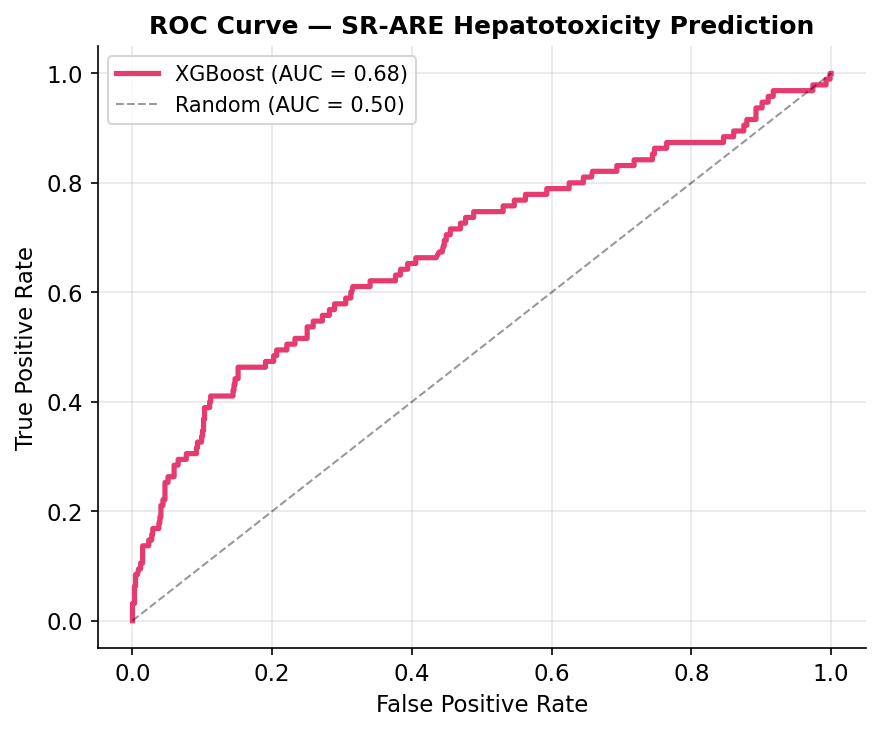
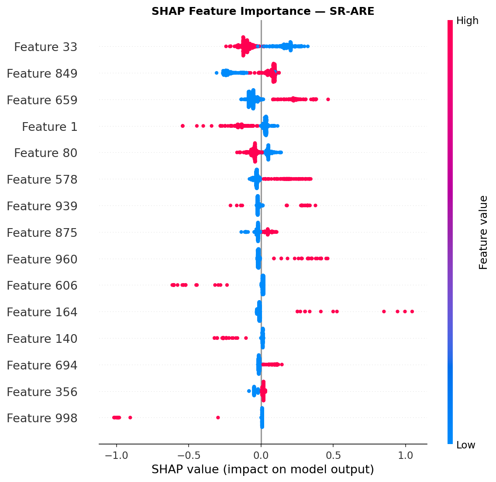

# ADMET Toxicity Predictor — Tox21

A ML project to predict hepatotoxicity risk from molecular structure alone, using the Tox21 dataset.

---

## What's the problem?

One of the biggest bottlenecks in drug discovery is that a molecule can work perfectly against its target and still fail in clinical trials, because it's toxic. Drug-induced liver injury (DILI) accounts for ~1 in 4.5 clinical trial 
failures and 1 in 3 market withdrawals due to adverse drug reactions (Dirven, H et al., 2021), making hepatotoxicity the leading 
organ-specific cause of drug attrition.

The goal here was to see how well we can predict hepatotoxicity risk from molecular structure alone, without any wet lab experiments.

---

## Dataset

**Tox21** a benchmark from Wu et al. (*MoleculeNet, Chemical Science, 2018*) with 8000 molecules tested across 12 toxicity assays.

Dataset loaded via DeepChem MoleculeNet 8000 compounds, 12 toxicity endpoints (NR-AR, NR-AhR, NR-AR-LBD, NR-ER, NR-ER-LBD, NR-PPAR-gamma, SR-ARE,SR-ATAD5, SR-HSE, SR-MMP, SR-p53)

I focused on **SR-ARE** (Stress Response - Antioxidant Response Element), which measures activation of the Nrf2/ARE pathway, a key indicator of oxidative stress-induced toxicity and a clinically relevant hepatotoxicity signal (Kim et al., 2016).

- 6 258 molecules in training
- Very imbalanced: only ~12% are toxic

---

## Approach

```
SMILES string → Morgan fingerprints (ECFP, 1024 bits) → XGBoost → toxicity score
```

1. Load data via **DeepChem** (`load_tox21` with ECFP featurizer)
2. Handle class imbalance with `scale_pos_weight`
3. Train **XGBoost** and evaluate with 5-fold cross-validation (AUC-ROC)
4. Explain predictions with **SHAP**
5. Test on real-world molecules

---

## Results

| Metric | Score |
|--------|-------|
| CV AUC (5-fold) | 0.704 ± 0.017 |
| Test AUC | 0.711 |

AUC = 0.71 is consistent with what tree-based models typically achieve on Tox21 (MoleculeNet benchmark). Getting above ~0.85 would require graph neural networks or 3D structural features.

### ROC Curve



### SHAP Feature Importance

Each point is a molecule. Red = feature present, blue = absent. Points to the right push the prediction toward *toxic*.



The SHAP plot shows which fingerprint bits matter most, even if we can't directly decode what chemical substructure each bit encodes.

---

## Test on known molecules

| Molecule | Risk score | Prediction | Reality |
|----------|-----------|------------|---------|
| Paracetamol | 0.563 | HIGH | Hepatotoxic at high doses ✓ |
| Aspirin | 0.452 | LOW | Generally safe ✓ |
| Troglitazone | 0.541 | HIGH | Withdrawn in 2000 for fatal hepatotox. ✓ |
| Caffeine | 0.468 | LOW | Generally safe ✓ |

The model got all four right, which was a nice sanity check.

---

## Stack

- `deepchem` — dataset loading + featurization
- `rdkit` — molecular fingerprints (Morgan/ECFP)
- `xgboost` — gradient boosting classifier
- `shap` — model explainability
- `scikit-learn` — cross-validation, metrics

---

## Limitations

- Morgan fingerprints lose all 3D structural information
- SR-ARE is a proxy for hepatotoxicity, not a direct measurement
- The model doesn't account for dose (any molecule is toxic at high enough concentration)
- Only ~6k training molecules, a pretty small dataset for this kind of problem

## What I'd do next

- Extend to all 12 Tox21 assays
- Try graph neural networks (GNNs) on the same task for comparison
- Look into 3D-aware molecular representations

---

*Dataset:* Wu Z, Ramsundar B, Feinberg Evan N, Gomes J, Geniesse C, Pappu AS, et al. MoleculeNet: a benchmark for molecular machine learning. Chemical Science. 2018;9(2):513–30.

*Sources:*
* Dirven, H., Vist, G.E., Bandhakavi, S. et al. Performance of preclinical models in predicting drug-induced liver injury in humans: a systematic review. Sci Rep 11, 6403 (2021). https://doi.org/10.1038/s41598-021-85708-2

* Kim MT, Huang R, Sedykh A, Wang W, Xia M, Zhu H. Mechanism Profiling of Hepatotoxicity Caused by Oxidative Stress Using Antioxidant Response Element Reporter Gene Assay Models and Big Data. Environ Health Perspect. 2016 May;124(5):634-41. doi: 10.1289/ehp.1509763. Epub 2015 Sep 18. PMID: 26383846; PMCID: PMC4858396.
